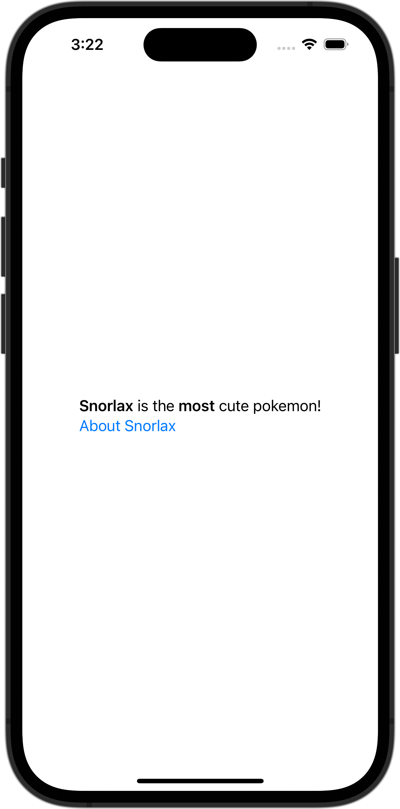

+++
title = "変数に格納したマークダウンを表示する"
url = "2023-11-08"
date = "2023-11-08"
description = "変数に格納したマークダウンを表示する"
tags = [
  "SwiftUI"
]
categories = [
  "SwiftUI"
]
archives = "2023/11"
aliases = ["migrate-from-jekyl"]
+++

 

変数に格納したマークダウンを表示する方法です。


