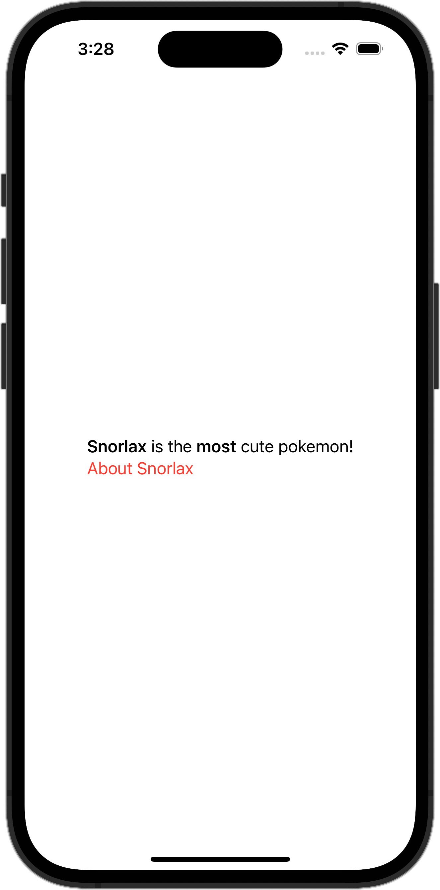

+++
title = "マークダウンのリンクの色を赤色に変える"
url = "2023-11-09"
date = "2023-11-09"
description = "マークダウンのリンクの色を赤色に変える"
tags = [
  "SwiftUI"
]
categories = [
  "SwiftUI"
]
archives = "2023/11"
aliases = ["migrate-from-jekyl"]
+++

 

マークダウンのリンクの色を赤色に変える方法です。


