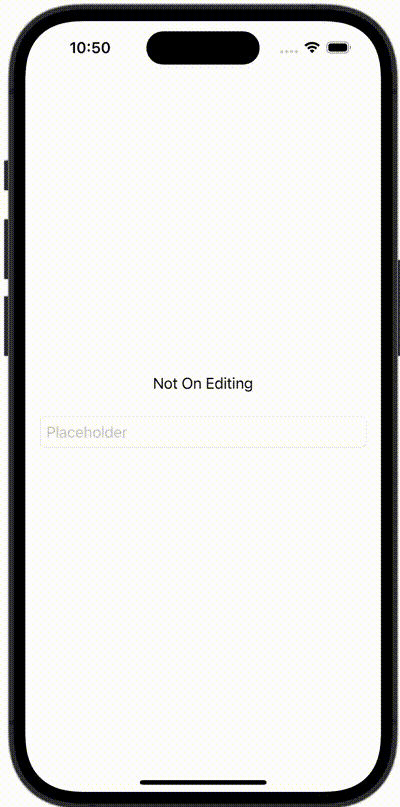

+++
title = "SwiftUIのTextFieldで編集中と編集完了を検知する"
url = "2023-11-13"
date = "2023-11-13"
description = "SwiftUIのTextFieldで編集中と編集完了を検知する"
tags = [
  "SwiftUI"
]
categories = [
  "SwiftUI"
]
archives = "2023/11"
aliases = ["migrate-from-jekyl"]
+++

 

SwiftUIのTextFieldで編集中と編集完了を検知する方法です。


