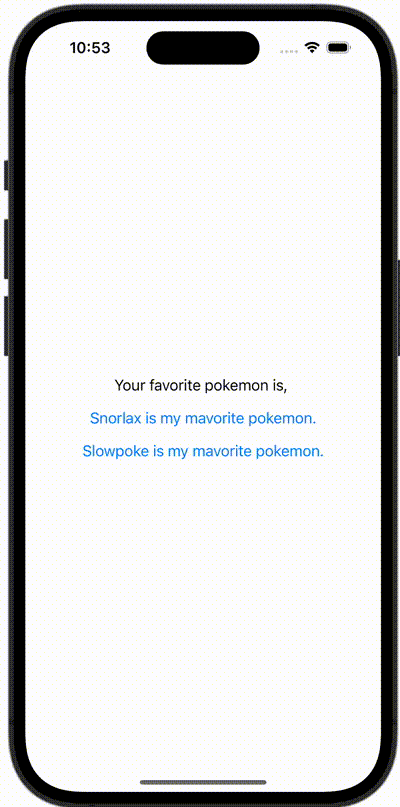

+++
title = "SwiftUIでAppStorageを使ってUserDefaultの値を監視する"
url = "2023-11-14"
date = "2023-11-14"
description = "SwiftUIでAppStorageを使ってUserDefaultの値を監視する"
tags = [
  "SwiftUI"
]
categories = [
  "SwiftUI"
]
archives = "2023/11"
aliases = ["migrate-from-jekyl"]
+++

 

SwiftUIでAppStorageを使ってUserDefaultの値を監視する方法です。


