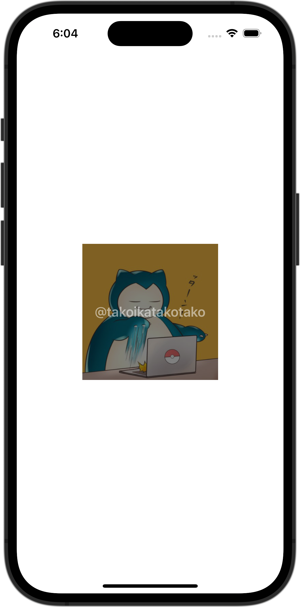

+++
title = "SwiftUIでViewの上にViewを重ねる"
url = "2023-11-15"
date = "2023-11-15"
description = "SwiftUIでViewの上にViewを重ねる"
tags = [
  "SwiftUI"
]
categories = [
  "SwiftUI"
]
archives = "2023/11"
aliases = ["migrate-from-jekyl"]
+++

 

SwiftUIでViewの上にViewを重ねる方法です。


