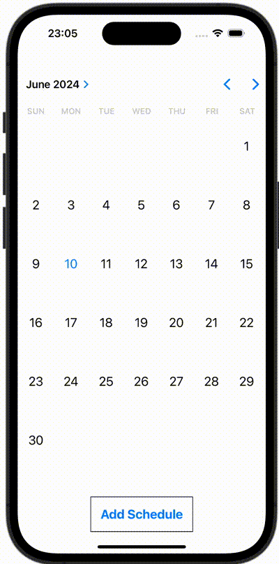

+++
title = "SwiftUIを使ったTODOアプリのサンプル"
url = "2023-11-17"
date = "2023-11-17"
description = "SwiftUIを使ったTODOアプリのサンプル"
tags = [
  "SwiftUI"
]
categories = [
  "SwiftUI"
]
archives = "2023/10"
aliases = ["migrate-from-jekyl"]
+++

 

SwiftUIを使ったTODOアプリのサンプルです。


