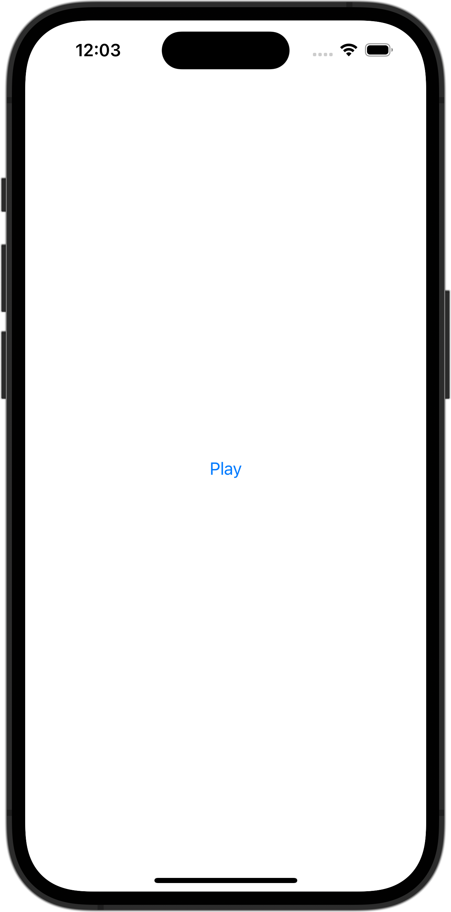

+++
title = "SwiftUIでAVAudioPlayerで音楽を再生し、再生終了を検知する"
url = "2023-11-18"
date = "2023-11-18"
description = "SwiftUIでAVAudioPlayerで音楽を再生し、再生終了を検知する"
tags = [
  "SwiftUI"
]
categories = [
  "SwiftUI"
]
archives = "2023/11"
aliases = ["migrate-from-jekyl"]
+++

 

SwiftUIでAVAudioPlayerで音楽を再生し、再生終了を検知する方法です。


