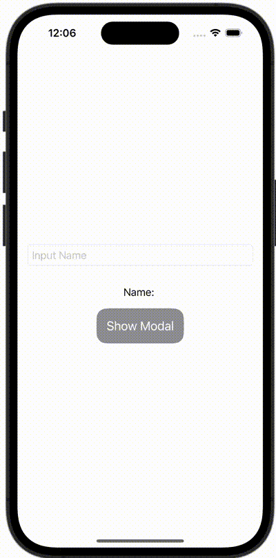

+++
title = "SwiftUIでモーダルを表示する時に値を渡す"
url = "2023-11-19"
date = "2023-11-19"
description = "SwiftUIでモーダルを表示する時に値を渡す"
tags = [
  "SwiftUI"
]
categories = [
  "SwiftUI"
]
archives = "2023/11"
aliases = ["migrate-from-jekyl"]
+++

 

SwiftUIでモーダルを表示する時に値を渡す方法です。


