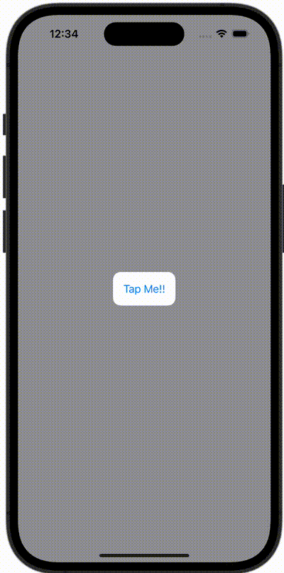

+++
title = "SwiftUIでボタンを押すとポップアップを表示する"
url = "2023-11-21"
date = "2023-11-21"
description = "SwiftUIでボタンを押すとポップアップを表示する"
tags = [
  "SwiftUI"
]
categories = [
  "SwiftUI"
]
archives = "2023/11"
aliases = ["migrate-from-jekyl"]
+++

 

SwiftUIでボタンを押すとポップアップを表示する法です。


