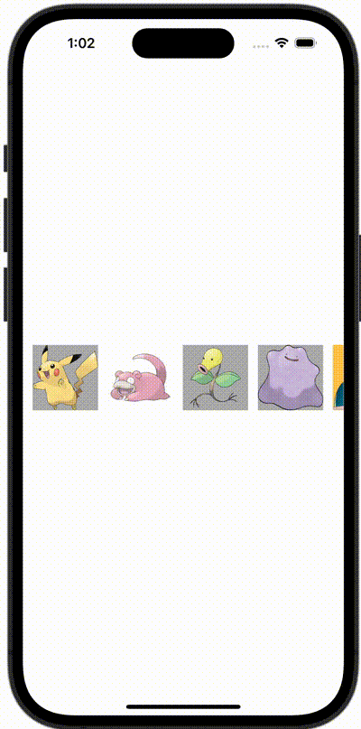

+++
title = "SwiftUIでViewを横スクロールで表示する"
url = "2023-11-22"
date = "2023-11-22"
description = "SwiftUIでViewを横スクロールで表示する"
tags = [
  "SwiftUI"
]
categories = [
  "SwiftUI"
]
archives = "2023/11"
aliases = ["migrate-from-jekyl"]
+++

 

SwiftUIでViewを横スクロールで表示する方法です。


