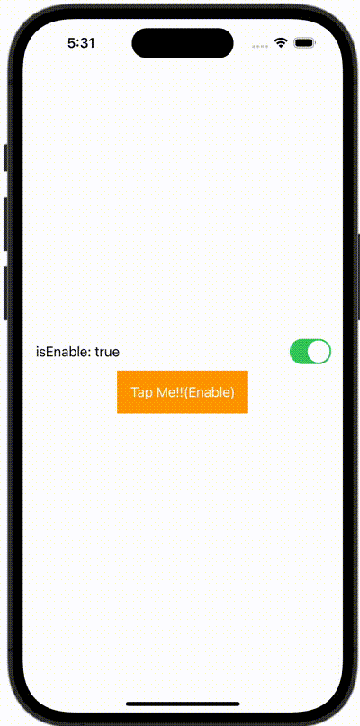

+++
title = "SwiftUIでButtonを有効にしたり無効にしたりする"
url = "2023-11-23"
date = "2023-11-23"
description = "SwiftUIでButtonを有効にしたり無効にしたりする"
tags = [
  "SwiftUI"
]
categories = [
  "SwiftUI"
]
archives = "2023/11"
aliases = ["migrate-from-jekyl"]
+++

 

SwiftUIでButtonを有効にしたり無効にしたりする方法です。


