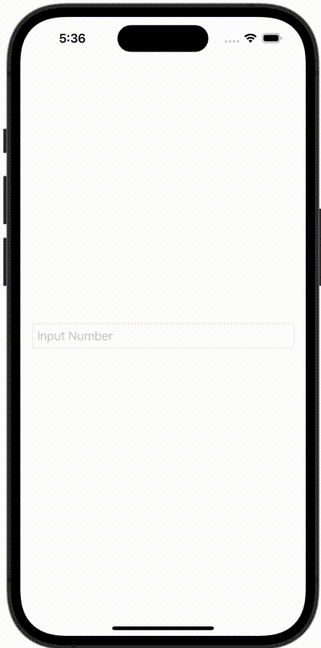

+++
title = "SwiftUIのTextFieldで表示するキーボードを指定する"
url = "2023-11-24"
date = "2023-11-24"
description = "SwiftUIのTextFieldで表示するキーボードを指定する"
tags = [
  "SwiftUI"
]
categories = [
  "SwiftUI"
]
archives = "2023/10"
aliases = ["migrate-from-jekyl"]
+++

 

SwiftUIのTextFieldで表示するキーボードを指定する方法です。


