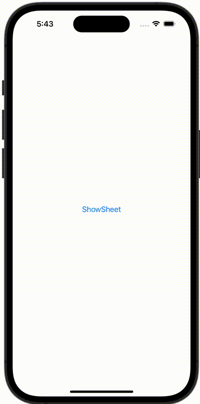

+++
title = "SwiftUIでシートを表示し、プッシュ遷移後にシートを閉じる"
url = "2023-11-25"
date = "2023-11-25"
description = "SwiftUIでシートを表示し、プッシュ遷移後にシートを閉じる"
tags = [
  "SwiftUI"
]
categories = [
  "SwiftUI"
]
archives = "2023/11"
aliases = ["migrate-from-jekyl"]
+++

 

SwiftUIでシートを表示し、プッシュ遷移後にシートを閉じる方法です。


