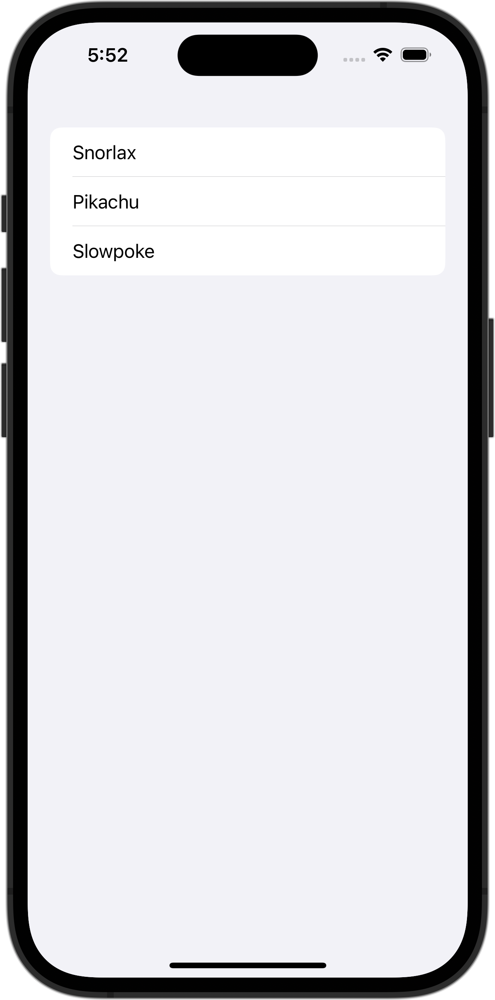

+++
title = "SwiftUIのListでSpacerの部分にもタップ判定をつける"
url = "2023-11-27"
date = "2023-11-27"
description = "SwiftUIのListでSpacerの部分にもタップ判定をつける"
tags = [
  "SwiftUI"
]
categories = [
  "SwiftUI"
]
archives = "2023/11"
aliases = ["migrate-from-jekyl"]
+++

 

SwiftUIのListでSpacerの部分にもタップ判定をつける方法です。


