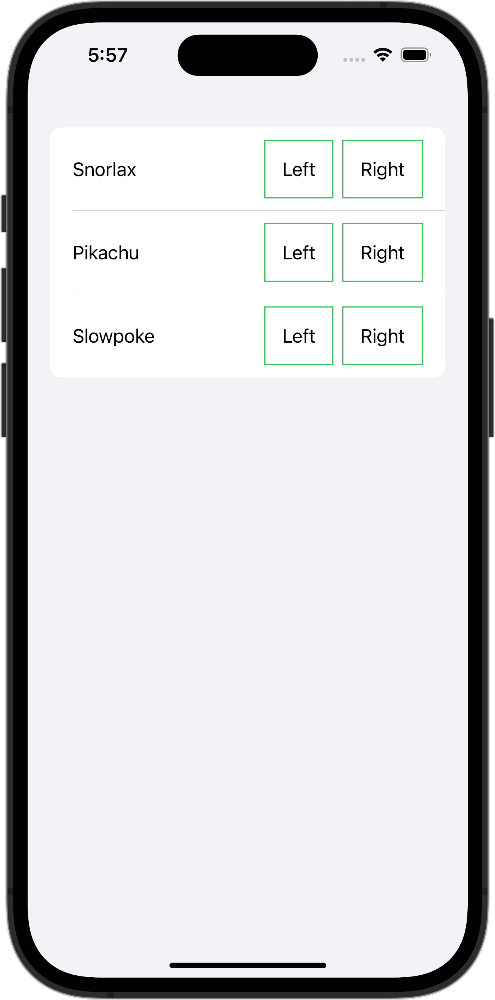

+++
title = "SwiftUIのListの中にボタンを複数設置する"
url = "2023-11-28"
date = "2023-11-28"
description = "SwiftUIのListの中にボタンを複数設置する"
tags = [
  "SwiftUI"
]
categories = [
  "SwiftUI"
]
archives = "2023/11"
aliases = ["migrate-from-jekyl"]
+++

 

SwiftUIのListの中にボタンを複数設置する方法です。


