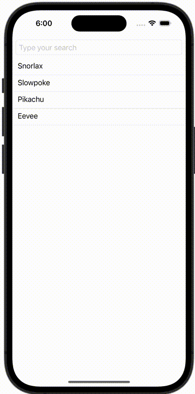

+++
title = "SwiftUIでSearchBar(TextField)を使って検索する"
url = "2023-11-29"
date = "2023-11-29"
description = "SwiftUIでSearchBar(TextField)を使って検索する"
tags = [
  "SwiftUI"
]
categories = [
  "SwiftUI"
]
archives = "2023/11"
aliases = ["migrate-from-jekyl"]
+++

 

SwiftUIでPreviewを横向きにする方法です。


