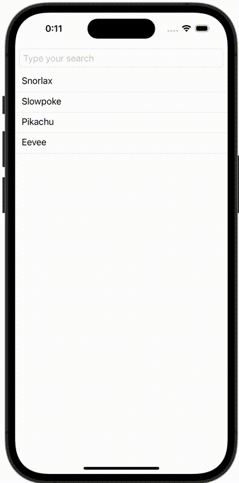

+++
title = "SwiftUIでSearchBar(TextField)にクリアボタンをつける"
url = "2023-11-30"
date = "2023-11-30"
description = "SwiftUIでSearchBar(TextField)にクリアボタンをつける"
tags = [
  "SwiftUI"
]
categories = [
  "SwiftUI"
]
archives = "2023/11"
aliases = ["migrate-from-jekyl"]
+++

 

SwiftUIでSearchBar(TextField)にクリアボタンをつける方法です。


