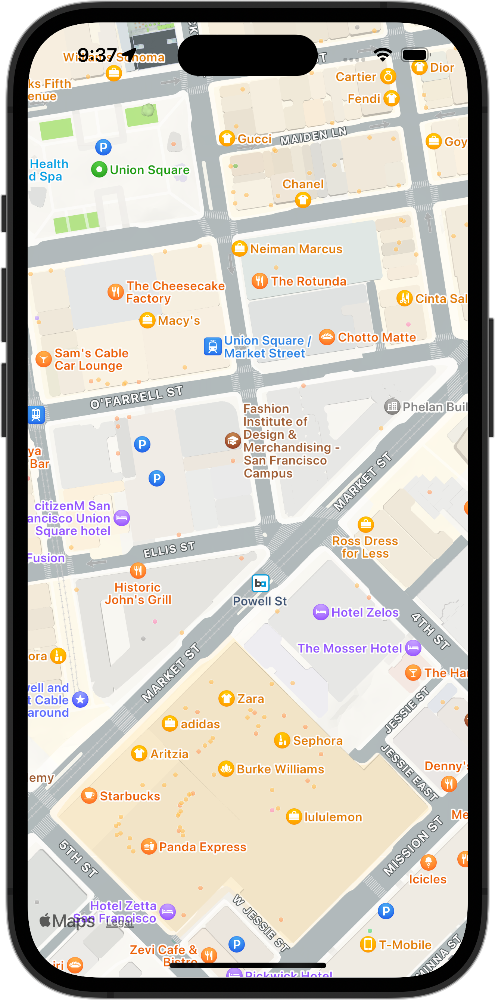

+++
title = "SwiftUIでMapを表示し、自分の位置を中心にする"
url = "2023-12-02"
date = "2023-12-02"
description = "SwiftUIでMapを表示し、自分の位置を中心にする"
tags = [
  "SwiftUI"
]
categories = [
  "SwiftUI"
]
archives = "2023/12"
aliases = ["migrate-from-jekyl"]
+++

 

SwiftUIでMapを表示し、自分の位置を中心にする方法です。


