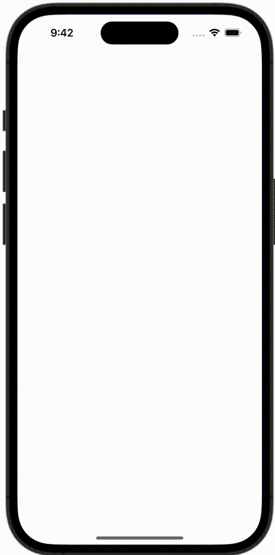

+++
title = "SwiftUIでMapを表示し、自分の位置を赤丸でマークする"
url = "2023-12-03"
date = "2023-12-03"
description = "SwiftUIでMapを表示し、自分の位置を赤丸でマークする"
tags = [
  "SwiftUI"
]
categories = [
  "SwiftUI"
]
archives = "2023/12"
aliases = ["migrate-from-jekyl"]
+++

 

SwiftUIでMapを表示し、自分の位置を赤丸でマークする方法です。


