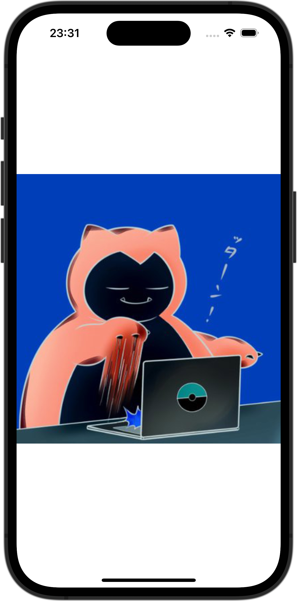

+++
title = "SwiftUIでImageの色を反転させる"
url = "2023-12-05"
date = "2023-12-05"
description = "SwiftUIでImageの色を反転させる"
tags = [
  "SwiftUI"
]
categories = [
  "SwiftUI"
]
archives = "2023/12"
aliases = ["migrate-from-jekyl"]
+++

 

SwiftUIでImageの色を反転させる方法です。


