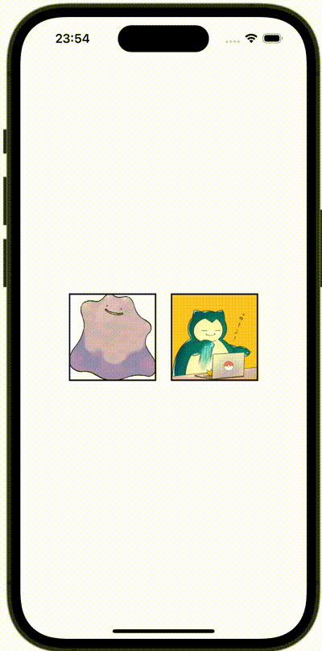

+++
title = "SwiftUIでアラートのメッセージを出し分ける"
url = "2023-12-07"
date = "2023-12-07"
description = "SwiftUIでアラートのメッセージを出し分ける"
tags = [
  "SwiftUI"
]
categories = [
  "SwiftUI"
]
archives = "2023/12"
aliases = ["migrate-from-jekyl"]
+++

 

SwiftUIでアラートのメッセージを出し分ける方法です。


