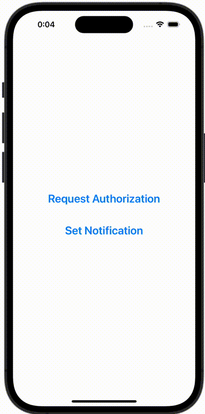

+++
title = "SwiftUIでローカル通知を送信する"
url = "2023-12-08"
date = "2023-12-08"
description = "SwiftUIでローカル通知を送信する"
tags = [
  "SwiftUI"
]
categories = [
  "SwiftUI"
]
archives = "2023/12"
aliases = ["migrate-from-jekyl"]
+++

 

SwiftUIでローカル通知を送信する方法です。


