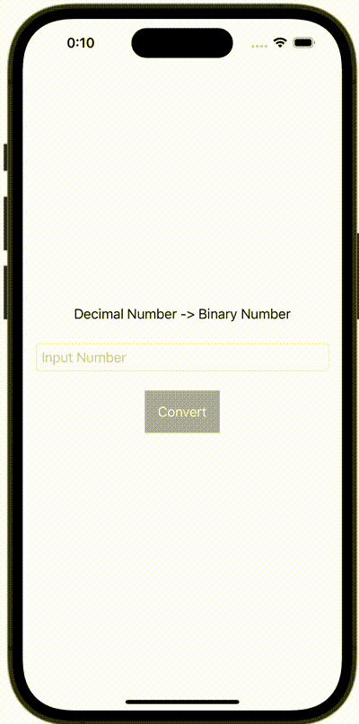

+++
title = "Swiftで10進数を2進数に変換する"
url = "2023-12-09"
date = "2023-12-09"
description = "Swiftで10進数を2進数に変換する"
tags = [
  "SwiftUI"
]
categories = [
  "SwiftUI"
]
archives = "2023/12"
aliases = ["migrate-from-jekyl"]
+++

 

Swiftで10進数を2進数に変換する方法です。


