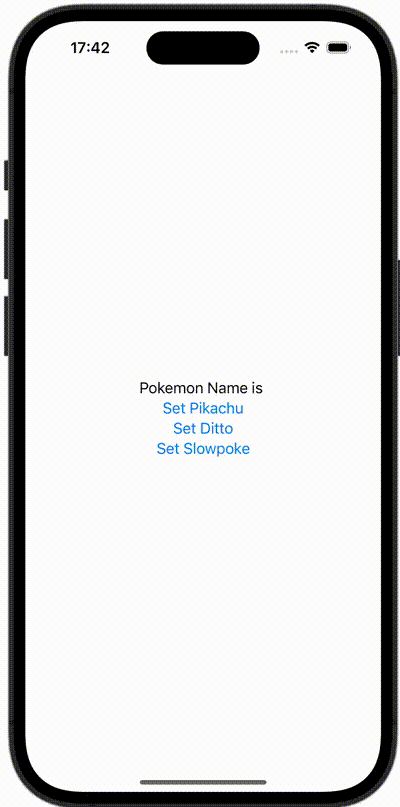

+++
title = "SwiftUIでAppDelegateを使用する"
url = "2023-12-10"
date = "2023-12-10"
description = "SwiftUIでAppDelegateを使用する"
tags = [
  "SwiftUI"
]
categories = [
  "SwiftUI"
]
archives = "2023/12"
aliases = ["migrate-from-jekyl"]
+++

 

SwiftUIでAppDelegateを使用する方法です。アプリ終了時にUserDefaultsに値を保存しています。


