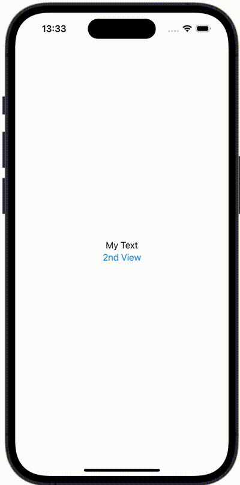

+++
title = "SwiftUIでdelegateを使用する"
url = "2023-12-12"
date = "2023-12-12"
description = "SwiftUIでdelegateを使用する"
tags = [
  "SwiftUI"
]
categories = [
  "SwiftUI"
]
archives = "2023/12"
aliases = ["migrate-from-jekyl"]
+++

 

SwiftUIでdelegateを使用する方法です。


