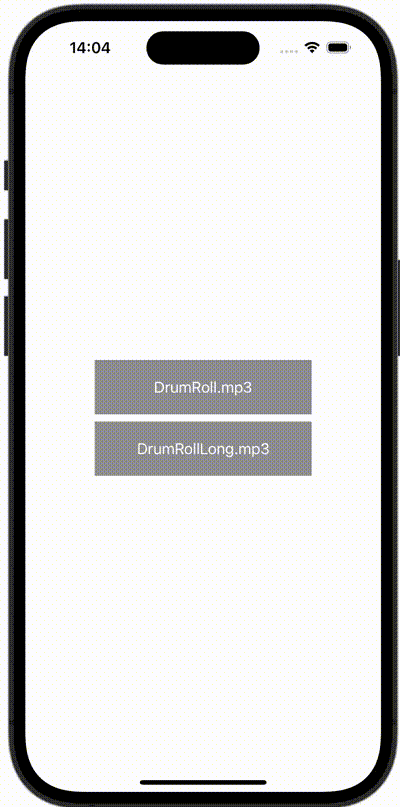

+++
title = "SwiftUIで音楽を再生する"
url = "2023-12-13"
date = "2023-12-13"
description = "SwiftUIで音楽を再生する"
tags = [
  "SwiftUI"
]
categories = [
  "SwiftUI"
]
archives = "2023/12"
aliases = ["migrate-from-jekyl"]
+++

 

SwiftUIで音楽を再生する方法です。


