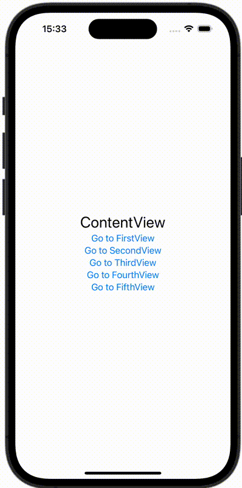

+++
title = "NavigationStackのpathを使って画面遷移する"
url = "2023-12-15"
date = "2023-12-15"
description = "NavigationStackのpathを使って画面遷移する"
tags = [
  "SwiftUI"
]
categories = [
  "SwiftUI"
]
archives = "2023/12"
aliases = ["migrate-from-jekyl"]
+++

 

NavigationStackのpathを使って画面遷移する方法です。


