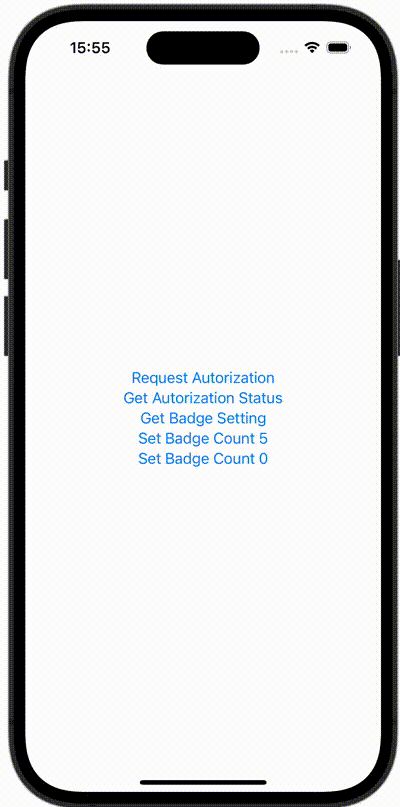

+++
title = "SwiftUIでBadgeを表示する"
url = "2023-12-16"
date = "2023-12-16"
description = "SwiftUIでBadgeを表示する"
tags = [
  "SwiftUI"
]
categories = [
  "SwiftUI"
]
archives = "2023/12"
aliases = ["migrate-from-jekyl"]
+++

 

SwiftUIでBadgeを表示する方法です。


