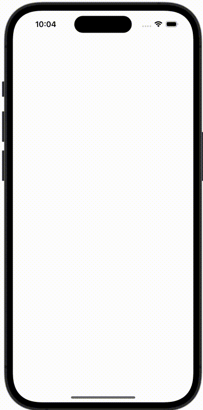

+++
title = "Swiftのasync,awaitを使ってAPIと画像を取得し、全てが揃ってから表示する"
url = "2023-12-17"
date = "2023-12-17"
description = "Swiftのasync,awaitを使ってAPIと画像を取得し、全てが揃ってから表示する"
tags = [
  "SwiftUI"
]
categories = [
  "SwiftUI"
]
archives = "2023/12"
aliases = ["migrate-from-jekyl"]
+++

 

Swiftのasync,awaitを使ってAPIと画像を取得し、全てが揃ってから表示する方法です。


