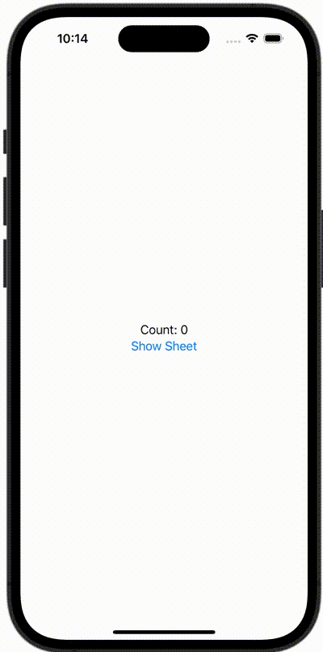

+++
title = "SwiftUIでObservableObjectの@publishedなプロパティとBindingする"
url = "2023-12-18"
date = "2023-12-18"
description = "SwiftUIでObservableObjectの@publishedなプロパティとBindingする"
tags = [
  "SwiftUI"
]
categories = [
  "SwiftUI"
]
archives = "2023/12"
aliases = ["migrate-from-jekyl"]
+++

 

SwiftUIでObservableObjectの@publishedなプロパティとBindingする方法です。


