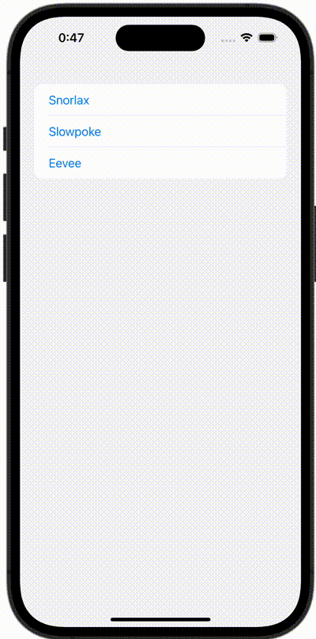

+++
title = "SwiftUIでListにButtonを設定して異なる画面に遷移する"
url = "2023-12-23"
date = "2023-12-23"
description = "SwiftUIでListにButtonを設定して異なる画面に遷移する"
tags = [
  "SwiftUI"
]
categories = [
  "SwiftUI"
]
archives = "2023/10"
aliases = ["migrate-from-jekyl"]
+++

 

SwiftUIでListにButtonを設定して異なる画面に遷移する方法です。


