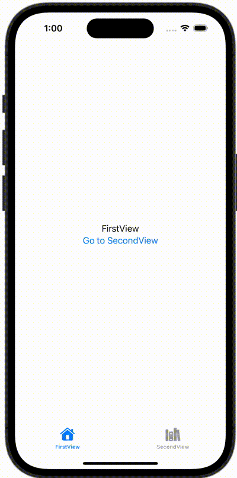

+++
title = "SwiftUIのTabViewのタブをコードから動的に切り替える"
url = "2023-12-24"
date = "2023-12-24"
description = "SwiftUIのTabViewのタブをコードから動的に切り替える"
tags = [
  "SwiftUI"
]
categories = [
  "SwiftUI"
]
archives = "2023/12"
aliases = ["migrate-from-jekyl"]
+++

 

SwiftUIのTabViewのタブをコードから動的に切り替える方法です。


