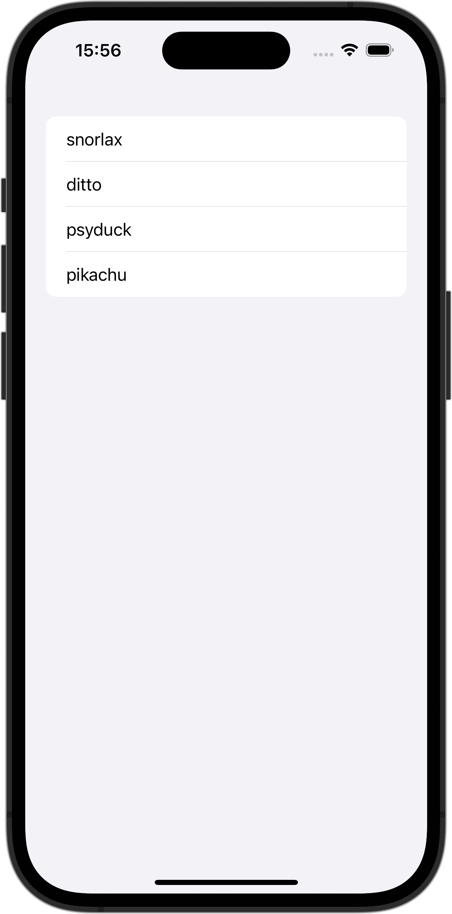

+++
title = "Identifiableに適合していないStructでListを使う"
url = "2023-12-25"
date = "2023-12-25"
description = "Identifiableに適合していないStructでListを使う"
tags = [
  "SwiftUI"
]
categories = [
  "SwiftUI"
]
archives = "2023/12"
aliases = ["migrate-from-jekyl"]
+++

 

Identifiableに適合していないStructでListを使う方法です。



