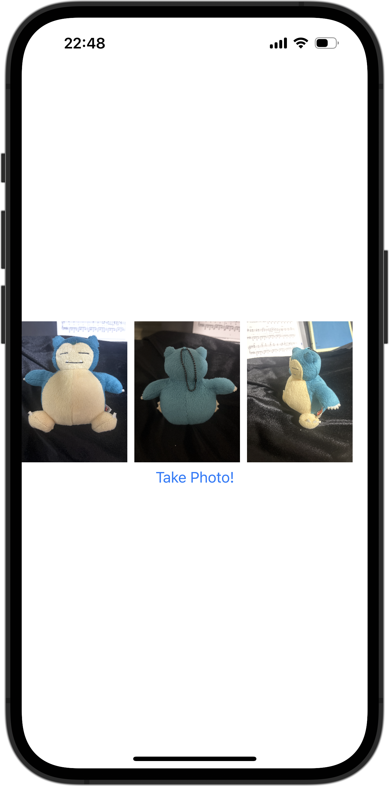

+++
title = "SwiftUIでカメラを使う"
url = "2023-12-26"
date = "2023-12-26"
description = "SwiftUIでカメラを使う"
tags = [
  "SwiftUI"
]
categories = [
  "SwiftUI"
]
archives = "2023/12"
aliases = ["migrate-from-jekyl"]
+++

 

SwiftUIでカメラを使う方法です。
カメラを利用できるViewを作成し、sheetで表示しています。
権限の追加も必要です。


