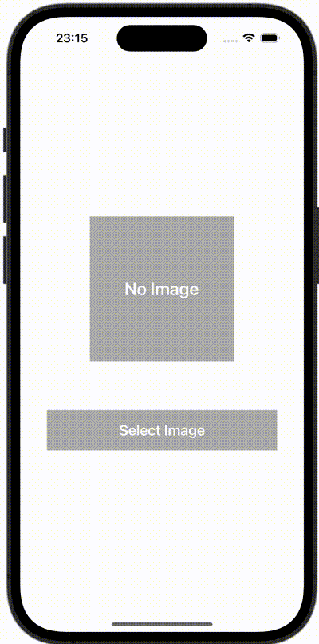

+++
title = "SwiftUIでPHPickerViewControllerを使って画像を選択する"
url = "2023-12-28"
date = "2023-12-28"
description = "SwiftUIでPHPickerViewControllerを使って画像を選択する"
tags = [
  "SwiftUI"
]
categories = [
  "SwiftUI"
]
archives = "2023/12"
aliases = ["migrate-from-jekyl"]
+++

 

SwiftUIでPHPickerViewControllerを使って画像を選択する方法です。


