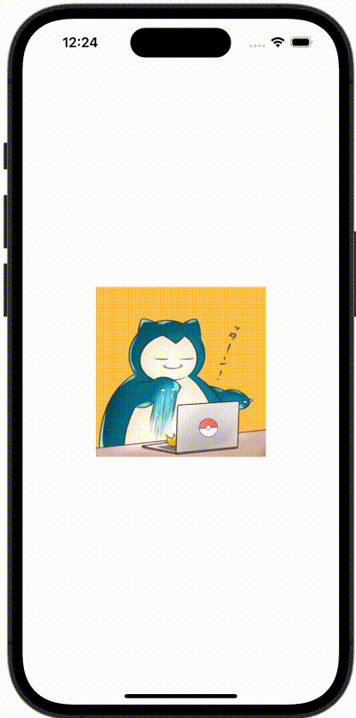

+++
title = "SwiftUIで画像をピンチで拡大する（MagnificationGesture）"
url = "2023-12-29"
date = "2023-12-29"
description = "SwiftUIで画像をピンチで拡大する（MagnificationGesture）"
tags = [
  "SwiftUI"
]
categories = [
  "SwiftUI"
]
archives = "2023/12"
aliases = ["migrate-from-jekyl"]
+++

 

SwiftUIでPreviewを横向きにする方法です。


